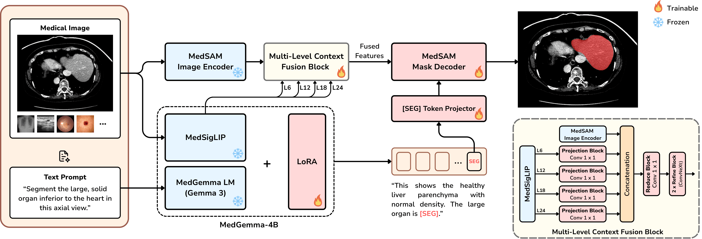
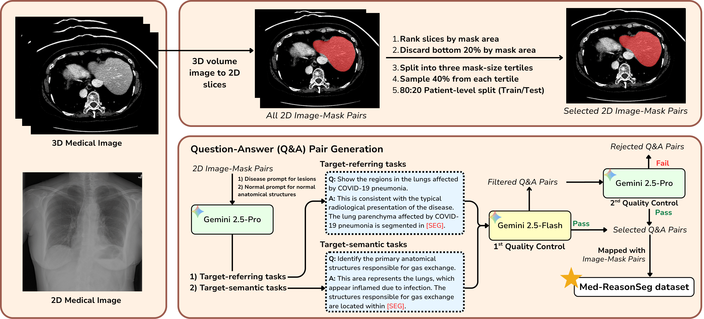

<h2 align="center">
  MedFuse-Seg: Multi-Level Visual and Semantic Context Fusion for Segmentation-Based Medical Reasoning (MICCAI 2026)
</h2>

---

MedFuse-Seg bridges the semantic-spatial gap in language-driven medical image analysis by combining multi-level visual feature injection with LLM-guided mask decoding. Built on MedGemma-4B, MedSigLIP, and MedSAM, the model allows clinicians to obtain both diagnostic reasoning and precise anatomical segmentation through natural language prompts.

We also introduce **Med-ReasonSeg**, a large-scale dataset of 539,383 image-mask-Q&A triplets spanning 9 modalities, verified via a two-stage LLM pipeline. MedFuse-Seg outperforms zero-shot BiomedParse by 13.49% DSC and 54.04 px HD95, and fine-tuned LISA-7B (same training setup) by 4.89% DSC and 15.29 px HD95.

<p align="center">
  
</p>

## Quick Start

### Installation

```bash
git clone https://github.com/biodatlab/medfuse-seg.git
cd medfuse-seg
pip install -r requirements.txt
```

### Download Checkpoints

**MedSAM ViT-B** (required) — download from the [original MedSAM paper's Google Drive](https://drive.google.com/file/d/1UAmWL88roYR7wKlnApw5Bcuzf2iQgk6_/view?usp=sharing) and place `medsam_vit_b.pth` in the repository root.

**Fine-tuned LoRA checkpoint** — download from [HuggingFace Hub](https://huggingface.co/biodatlab/medfuse-seg):
```bash
huggingface-cli download biodatlab/medfuse-seg --repo-type model --local-dir ckpts
```

**MedGemma-4B-IT** will be downloaded automatically from HuggingFace Hub on first run.

### Inference

```python
from medfuseseg import MedFuseSegPipeline

pipe = MedFuseSegPipeline(checkpoint="ckpts")

result = pipe(
    image="chest_xray.png",
    prompt="Segment the pneumonia region"
)

print(result.text)
result.save_mask("mask.png")
result.save_overlay("vis.png")
```

Input can be a file path, URL, PIL Image, or numpy array. The model generates a descriptive answer along with a segmentation mask.

### Web Demo

```bash
python app.py \
  --version="google/medgemma-4b-it" \
  --vision-tower="google/medgemma-4b-it" \
  --model_path="path/to/ckpt_model" \
  --precision="bf16"
```

A Gradio web interface will launch. Upload an image and text prompt to get a segmentation mask.

## Training

MedFuse-Seg is trained with DeepSpeed ZeRO-2 on 4× A100 GPUs using PEFT: LoRA (r=64, α=128) on MedGemma and MedSigLIP, with the projector, fusion adapter, and SAM mask decoder fully fine-tuned.

```bash
bash train.sh

# Or run directly:
deepspeed --num_gpus=4 train_ds.py \
  --version="google/medgemma-4b-it" \
  --vision-tower="google/medgemma-4b-it" \
  --vision_pretrained="medsam_vit_b.pth" \
  --val_dataset="hf_refseg|test" \
  --epochs=5 --steps_per_epoch=13371 \
  --batch_size=8 --grad_accumulation_steps=1 \
  --lr=1e-4 --precision="bf16" \
  --lora_r=64 --lora_alpha=128 \
  --lora_target_modules="q_proj,v_proj,k_proj,o_proj,gate_proj,up_proj,down_proj,out_proj,fc1,fc2" \
  --gradient_checkpointing
```

## Evaluation

```bash
bash eval.sh

# Or directly:
deepspeed --num_gpus=4 evaluate.py \
  --model_path="path/to/ckpt_model" \
  --val_dataset="hf_refseg|test" \
  --precision="bf16"
```

Reports **DSC**, **HD95**, **gIoU**, and **cIoU** on the test set.

## Dataset

Med-ReasonSeg is available on [HuggingFace Hub](https://huggingface.co/datasets/biodatlab/Med-ReasonSeg), containing 427,861 training and 111,522 test image-mask-Q&A triplets across 9 modalities (MRI, CT, X-ray, dermoscopy, fundus, endoscopy, OCT, mammography, ultrasound).

<p align="center">
  
</p>

## Results

| Method | DSC (Ref) | DSC (Sem) | DSC (Avg) | HD95 (Ref) | HD95 (Sem) | HD95 (Avg) |
|--------|-----------|-----------|-----------|------------|------------|------------|
| SAM 3 (zero-shot) | 0.1425 | 0.1167 | 0.1296 | 373.52 | 370.50 | 372.01 |
| BiomedParse (zero-shot) | 0.6703 | 0.6344 | 0.6524 | 105.23 | 115.97 | 110.60 |
| LISA-7B (fine-tuned) | 0.7398 | 0.7370 | 0.7384 | 71.55 | 72.13 | 71.84 |
| **MedFuse-Seg (Ours)** | **0.7879** | **0.7867** | **0.7873** | **56.46** | **56.65** | **56.55** |

> LISA-7B was retrained with identical training setup, dataset, and hyperparameters for a fair comparison.

## Acknowledgements

This project is developed on the codebase of [LISA](https://github.com/JIA-Lab-research/LISA) and data from the [BiomedParse Dataset](https://huggingface.co/datasets/microsoft/BiomedParseData). We thank the authors for their foundational work. We also thank the developers of [MedGemma](https://huggingface.co/google/medgemma-4b-it), [MedSAM](https://github.com/bowang-lab/MedSAM), and [SAM](https://github.com/facebookresearch/segment-anything) for providing pretrained models that made this work possible.

## Citation

```bibtex
@inproceedings{LimKee_MedFuseSeg_MICCAI2026,
  title={MedFuse-Seg: Multi-Level Visual and Semantic Context Fusion for Segmentation-Based Medical Reasoning},
  author={Limaroon, Keetawan and Chiewhawan, Monrada and Timklaypachara, Watcharapong and Vateekul, Peerapon and Achakulvisut, Titipat},
  booktitle = {Proceedings of Medical Image Computing and Computer Assisted Intervention -- MICCAI 2026},
  year={2026}
}
```

## License

Apache-2.0 License. See [LICENSE](LICENSE) for details.
