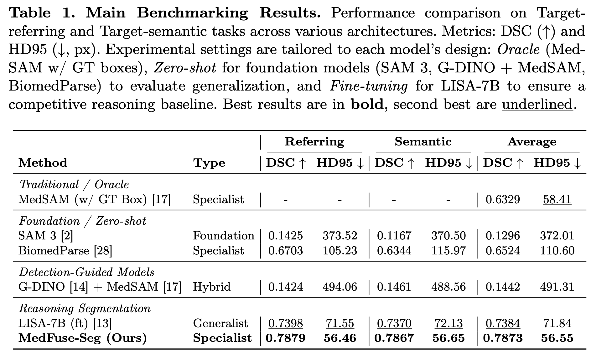

<h2 align="center">
  MedFuse-Seg: Multi-Level Visual and Semantic Context Fusion for Segmentation-Based Medical Reasoning 

  (MICCAI 2026)

  </h2>

<p align="center">
    <a><strong>Keetawan Limaroon</strong></a><sup>1</sup>
    ·
    <a><strong>Monrada Chiewhawan</strong></a><sup>2,3</sup>
    ·
    <a><strong>Watcharapong Timklaypachara</strong></a><sup>2,3</sup>
    <br>
    <a><strong>Peerapon Vateekul</strong></a><sup>4*</sup>
    ·
    <a><strong>Titipat Achakulvisut</strong></a><sup>2*</sup>
    <br>
    <sup>1</sup>Department of Computer Engineering, King Mongkut's University of Technology Thonburi, Bangkok, Thailand
    <br>
    <sup>2</sup>Department of Biomedical Engineering, Faculty of Engineering, Mahidol University, Nakhon Pathom, Thailand
    <sup>3</sup>Faculty of Medicine Ramathibodi Hospital, Mahidol University, Bangkok, Thailand
    <br>
    <sup>4</sup>Department of Computer Engineering, Faculty of Engineering, Chulalongkorn University, Bangkok, Thailand
    <br>
    *Corresponding authors: <em>titipat.ach@mahidol.ac.th</em>, <em>peerapon.v@chula.ac.th</em>
</p>

---

MedFuse-Seg is a reasoning-driven medical image segmentation architecture that combines multi-level visual feature injection with LLM-guided mask decoding. By integrating MedGemma-4B, MedSigLIP, and MedSAM, the model bridges the semantic-spatial gap in language-driven medical analysis — allowing clinicians to obtain both diagnostic reasoning and precise anatomical segmentation through natural language prompts.

<p align="center">
  
</p>
<p align="center">MedFuse-Seg architecture overview.</p>

## 🔥 Highlights

### Med-ReasonSeg: Large-Scale Reasoning Dataset
- **539,383** image-mask-Q&A triplets across **9 modalities** from **16 datasets**
- Two task types: **target-referring** (explicit naming) and **target-semantic** (implicit reasoning)
- Two-stage LLM verification (Gemini 2.5-Flash → Gemini 2.5-Pro) reduces noisy Q&A pairs and improves DSC by **0.02** and HD95 by **2.52 px** (p < 0.001)

### Multi-Level Context Fusion
- Injects hierarchical MedSigLIP features into the MedSAM encoder via a dedicated fusion block with ConvNeXt refinement
- Combines low-level spatial details (edges, shapes) with high-level medical semantics, reducing HD95 by **13.19 px** over the LISA-style baseline

### Reasoning-Guided Mask Decoding
- The `[SEG]` token generated by MedGemma is projected into SAM's prompt embedding space, enabling chain-of-thought reasoning before segmentation
- Placing `[SEG]` at the end of the response (think-before-act) reduces HD95 by **1.08 px** (p < 0.001)

### State-of-the-Art Performance
- Outperforms zero-shot BiomedParse by **13.49% DSC** and **54.04 px HD95**
- Outperforms fine-tuned LISA-7B (same training setup) by **4.89% DSC** and **15.29 px HD95**, despite using fewer parameters (4B vs 7B)


---

## Quick Start

### Installation

```bash
git clone https://github.com/<your-repo>/MedFuse-Seg.git
cd MedFuse-Seg
pip install -r requirements.txt
```

### Download Checkpoints

**MedSAM ViT-B** (required):
```bash
gdown "https://drive.google.com/uc?id=1UAmWL88roYR7wKlnApw5Bcuzf2iQgk6_"
```
Or download manually from [Google Drive](https://drive.google.com/file/d/1UAmWL88roYR7wKlnApw5Bcuzf2iQgk6_/view?usp=sharing).
Place `medsam_vit_b.pth` in the repository root.

**Fine-tuned LoRA checkpoint**:
```bash
# Download via HF Hub
huggingface-cli download biodatlab/medfuse-seg --repo-type model --local-dir ckpts
```

**MedGemma-4B-IT** will be downloaded automatically from HuggingFace Hub on first run.

### Inference

```python
from medfuseseg import MedFuseSegPipeline

pipe = MedFuseSegPipeline(checkpoint="path/to/ckpt_model")

result = pipe(
    image="chest_xray.png",
    prompt="Segment the pneumonia region"
)

print(result.text)       # Generated reasoning + [SEG] tokens
result.show()            # Display image with mask overlay
result.save_mask("mask.png")
result.save_overlay("vis.png")
```

Accepts file paths, URLs, PIL Images, or numpy arrays.

## Model Architecture

MedFuse-Seg integrates three foundation models:

- **MedGemma-4B** — multimodal LLM for clinical reasoning
- **MedSigLIP** — medical vision encoder (hierarchical features from layers 6, 12, 18, 24)
- **MedSAM** (ViT-B) — segmentation engine (encoder frozen, mask_decoder trainable)

### Training Strategy

| Component | Method |
|-----------|--------|
| MedGemma text layers | LoRA (r=64, α=128) |
| MedSigLIP vision layers | LoRA (r=64, α=128) |
| SAM mask decoder | Full train |
| MedFuseSegProjector | Full train |
| SiglipSamFusionAdapter | Full train |
| SAM encoder, MedSAM backbone | Frozen |

**Loss**: `L = CE + 4×BCE_focal + 2×Dice`

## Training

```bash
# Single node, multi-GPU
bash train.sh
```

Or run directly:

```bash
deepspeed --num_gpus=4 train_ds.py \
  --version="google/medgemma-4b-it" \
  --vision-tower="google/medgemma-4b-it" \
  --vision_pretrained="medsam_vit_b.pth" \
  --val_dataset="hf_refseg|test" \
  --epochs=5 \
  --steps_per_epoch=13371 \
  --batch_size=8 \
  --lr=1e-4 \
  --precision="bf16" \
  --lora_r=64 \
  --lora_alpha=128 \
  --gradient_checkpointing
```

## Evaluation

```bash
bash eval.sh

# Or directly:
deepspeed --num_gpus=4 evaluate.py \
  --version="google/medgemma-4b-it" \
  --vision-tower="google/medgemma-4b-it" \
  --vision_pretrained="medsam_vit_b.pth" \
  --model_path="path/to/ckpt_model" \
  --val_dataset="hf_refseg|test" \
  --precision="bf16"
```

Reports: **gIoU**, **cIoU**, **Dice (DSC)**, **HD95**

## Inference

### Single model, full dataset

```bash
deepspeed --num_gpus=4 inference.py \
  --version="google/medgemma-4b-it" \
  --vision-tower="google/medgemma-4b-it" \
  --model_path="path/to/ckpt_model" \
  --val_dataset="hf_refseg|test" \
  --results_dir="./results"
```

### Gradio Web App

```bash
python app.py \
  --version="google/medgemma-4b-it" \
  --vision-tower="google/medgemma-4b-it" \
  --model_path="path/to/ckpt_model" \
  --precision="bf16"
```

## Dataset

### Med-ReasonSeg

Available on HuggingFace Hub: [`biodatlab/Med-ReasonSeg`](https://huggingface.co/datasets/biodatlab/Med-ReasonSeg)

<p align="center">
  
</p>
<p align="center">Med-ReasonSeg dataset construction pipeline.</p>

| Split | Samples |
|-------|--------|
| Train | 427,861 |
| Test | 111,522 |

- **9 modalities**: MRI, CT, X-ray, Dermoscopy, Fundus, Endoscopy, OCT, Mammography, Ultrasound
- **2 task types**: Target-referring (explicit naming) + Target-semantic (implicit reasoning)
- **2 LLM-based verification stages** (Gemini 2.5-Flash → Gemini 2.5-Pro)

### Construction Pipeline

1. **Data curation**: 3D volume slice sampling by mask area stratification, patient-level 80:20 split
2. **Q&A generation**: Gemini 2.5-Pro with visual grounding (6 variants per unique mask)
3. **Verification**: rule-based filter → Gemini 2.5-Flash screener → Gemini 2.5-Pro specialist

## Results

<p align="center">
  
</p>
<p align="center"><b>Table 1.</b> Main benchmarking results on the Med-ReasonSeg test set.</p>

> LISA-7B was retrained with identical training setup, dataset, and hyperparameters for a fair comparison.

<p align="center">
  
</p>
<p align="center">Qualitative Results.</p>

## Acknowledgements

This project is developed on the codebase of [LISA](https://github.com/JIA-Lab-research/LISA) and data from the [BiomedParse Dataset](https://huggingface.co/datasets/microsoft/BiomedParseData). We sincerely appreciate the original authors for their foundational work and valuable contributions to the community. We also thank the developers of [MedGemma](https://huggingface.co/google/medgemma-4b-it), [MedSAM](https://github.com/bowang-lab/medsam), and [SAM](https://github.com/facebookresearch/segment-anything) for providing pretrained models that made this work possible.

## Citation

```bibtex
@inproceedings{KeeLim_MedFuseSeg_MICCAI2026,
  title={MedFuse-Seg: Multi-Level Visual and Semantic Context Fusion for Segmentation-Based Medical Reasoning},
  author={Limaroon, Keetawan and Chiewhawan, Monrada and Timklaypachara, Watcharapong and Vateekul, Peerapon and Achakulvisut, Titipat},
  booktitle = {proceedings of Medical Image Computing and Computer Assisted Intervention -- MICCAI 2026},
  year={2026}
}
```

## License

Apache-2.0 License. See [LICENSE](LICENSE) for details.
